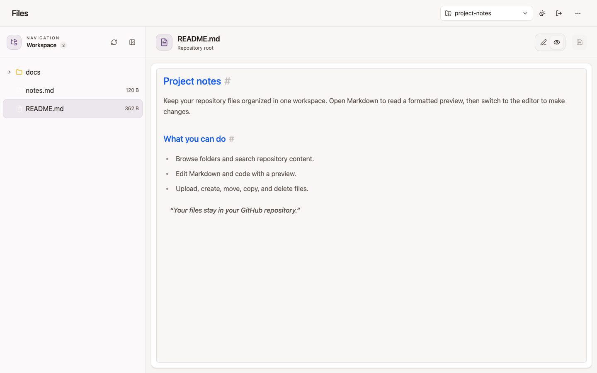

# Kody Files

Kody Files is a standalone file manager for GitHub repositories. Browse a repository, preview documents, edit text, search, and manage files from one browser workspace. Sign in with a GitHub personal access token; no OAuth app or Kody account is required.

**[Open the hosted app](https://files.thedigitalreality.app/)** · [How it works](docs/architecture.md) · [Contributing](CONTRIBUTING.md)



## Features

- Browse folders and switch repositories from a searchable dropdown.
- Preview Markdown, code, images, PDF, audio, video, HTML, and supported office/archive formats.
- Edit text with Monaco and view Markdown as formatted content.
- Create, upload, rename, move, copy, and delete files; inspect commit history where supported.
- Choose a light, dark, or system theme. The layout also works on narrow screens.

The screenshots use **sample data and a fake token**. They contain no real repository content or credentials. See the [sign-in screen](docs/screenshots/sign-in.png), [repository picker](docs/screenshots/repository-picker.png), and [dark theme](docs/screenshots/workspace-dark.png).

## Run locally

You need Node.js 24 and pnpm 9. No environment variables are needed for normal use.

```bash
git clone https://github.com/aharonyaircohen/kody-files.git
cd kody-files
pnpm install --frozen-lockfile
pnpm dev
```

Open [http://localhost:3335/](http://localhost:3335/). Enter a GitHub personal access token that can access the repositories you want to use. To edit files, the token needs repository contents write permission. For a fine-grained token, select the intended repositories and grant **Contents: read and write**. Use the smallest repository scope you need. The app verifies the token, lists accessible repositories, and lets you select one.

The header's **Forget token** button removes the saved token and selected repository from this browser. Read [SECURITY.md](SECURITY.md) before using the app with sensitive repositories.

## How data is stored

| Data | Location |
| --- | --- |
| Repository files and history | GitHub |
| Token, selected repository, theme, and unsaved editor drafts | This browser's local storage |
| App database | None |

Repository listing and ordinary file operations pass the token through same-origin API routes to GitHub. Uploads send the file and token directly from the browser to GitHub's Contents API, avoiding Vercel's function request-body limit. The server does not have a GitHub token configured. [Architecture and request flow](docs/architecture.md).

**Upload limit:** the UI accepts files up to 100 MiB because GitHub blocks larger regular Git objects. That is not a guarantee that the Contents API accepts every file below the cap. An upload of exactly 80,000,000 bytes through the deployed app failed with GitHub HTTP 401 while normal token requests still worked. GitHub [documents a 25 MiB limit for its browser upload UI](https://docs.github.com/en/repositories/working-with-files/managing-files/adding-a-file-to-a-repository) and recommends the command line for larger regular Git files. Kody Files does not use Git LFS.

## Develop and deploy

- [Development and testing](docs/development.md)
- [Architecture and file manager transport](docs/architecture.md)
- [Deployment](docs/deployment.md)
- [Releases](docs/releases.md)
- [Contributing](CONTRIBUTING.md) · [Security policy](SECURITY.md) · [Code of conduct](CODE_OF_CONDUCT.md)

The UI follows Kody Chat's color palette and Markdown formatting. Existing browser settings from the former GitHub Files name migrate automatically; saved editor drafts keep their original storage keys.

## License

Kody Files is [MIT licensed](LICENSE). The file manager was adapted from the MIT-licensed Kody Dashboard; its original copyright is retained in the license. See [third-party notices](THIRD_PARTY_NOTICES.md) for the bundled libarchive preview files and dependency audit command.
