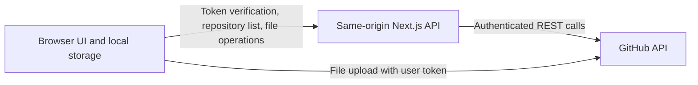

# Architecture

Kody Files is a Next.js app with a reusable file manager and a GitHub-backed adapter. GitHub holds repository content and history. The app has no database.

## Main pieces

| Area | Responsibility |
| --- | --- |
| `src/app/files/FileManagerApp.tsx` | Sign-in state, repository selection, theme, and file manager setup |
| `src/app/files/browser-storage.ts` | Browser keys and migration from the former GitHub Files name |
| `src/file-manager/` | Reusable tree, editor, previews, search, and file actions |
| `src/app/files/server-files-transport.ts` | Adapter for ordinary file requests through `/api/files` |
| `src/app/files/direct-github-upload.ts` | Browser-to-GitHub blob upload and tree commit |
| `src/app/api/` | Token verification, repository listing, and file operation routes |
| `src/shared/markdown/` | Markdown editor and rendered preview |

The reusable file manager depends on its `FilesTransport` contract. GitHub-specific logic belongs in the transport or app adapter, so a different storage provider can supply the same UI contract without changing the shared components. See [the file manager guide](../src/file-manager/guide.md) and [`FilesTransport`](../src/file-manager/lib/transport.tsx).

## Request flow

1. The user enters a GitHub token. The browser sends it to `/api/auth/token`, which checks it with GitHub and returns the login name.
2. `/api/repos` lists repositories available to the token. The selected repository is remembered in this browser.
3. The workspace calls `/api/files` for browsing, reading, editing, searching, history, and other ordinary operations. The route passes the token to GitHub for each request.
4. File uploads use the user's token in the browser to create a Git blob, attach it to a tree, create a commit, and advance the repository's default branch. This avoids the Vercel Function request-body limit. The existing tree commit helper retries when the branch advances concurrently.

The root route is `/`. File selections use `/?path=...`; the old `/files` route redirects to the root. GitHub remains the source of truth for file content and history.

## Browser storage and trust boundary

The token, selected repository, and theme live in local storage under `kody-files-*` keys. Editor drafts also live in local storage and retain their previous key format so older unsaved work remains available. The app migrates the former `github-files-*` preferences on first load.

There is no server-side token store, but same-origin requests carry the token through the app server. Uploads send it directly to GitHub. A user should trust the hosted origin and browser environment before entering a token. The API checks the request origin and parses permitted file operations; HTML previews use a sandbox and restrictive content security policy.

## Limits

- GitHub permissions, rate limits, and SHA conflicts apply to repository operations.
- The 30 MB UI validation cap is based on a successful end-to-end browser upload. GitHub rejected 40 MB with HTTP 401 and 50–80 MB with HTTP 422 on the Git Blobs API. Git LFS is not implemented.
- Large text saves still use `/api/files`; only uploads bypass the Vercel request-body limit.
- Preview support depends on format and available renderer. Some binary files cannot be edited as text.
